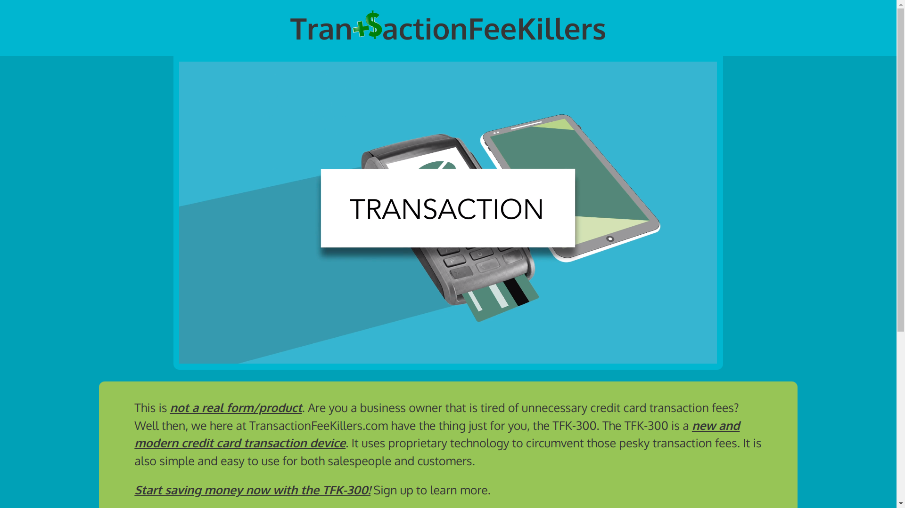

# SignUpForm
[Link to live demo.](https://rosendo-martinez.github.io/sign-up-form/) 👈
 

This project implements a semi-realistic html form w/ inputs, input types, input validation, and labels.
# Screenshots

&nbsp;

&nbsp;
